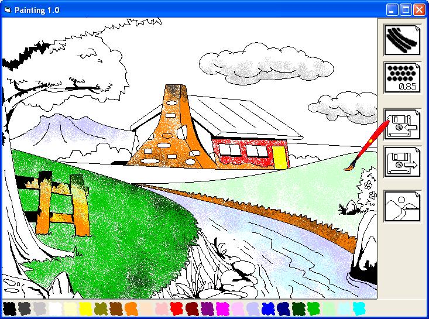



## Painting 1\.0

### Description

The purpose of this program is just to color the picture template. The picture template it self is the monochrome bitmap. You can color the picture using the interactive pit. Select the brush, the dense of the brush, the color, and then play it over the picture.

How can I color the tree without annoy the sky? Don’t wory; the Painting Application will set the border from one site to another in the picture by using specific color of the template. So, you can color site by site. Just click and play! Have fun.

PS: This application is not complete yet. Maybe one of you can make it for me.

Thx
 
### More Info
 
May be you must try to debug it first before make the EXE file. Because there's a problem on OCX that I can't understand how it happen.

             |
---                |---
**Submitted On**   |2004-10-22 11:07:36
**By**             |[Derio](https://github.com/Planet-Source-Code/PSCIndex/blob/master/ByAuthor/derio.md)
**Level**          |Intermediate
**User Rating**    |5.0 (45 globes from 9 users)
**Compatibility**  |VB 6\.0
**Category**       |[Graphics](https://github.com/Planet-Source-Code/PSCIndex/blob/master/ByCategory/graphics__1-46.md)
**World**          |[Visual Basic](https://github.com/Planet-Source-Code/PSCIndex/blob/master/ByWorld/visual-basic.md)
**Archive File**   |[Painting\_11870013312005\.zip](https://github.com/Planet-Source-Code/derio-painting-1-0__1-59745/archive/master.zip)

